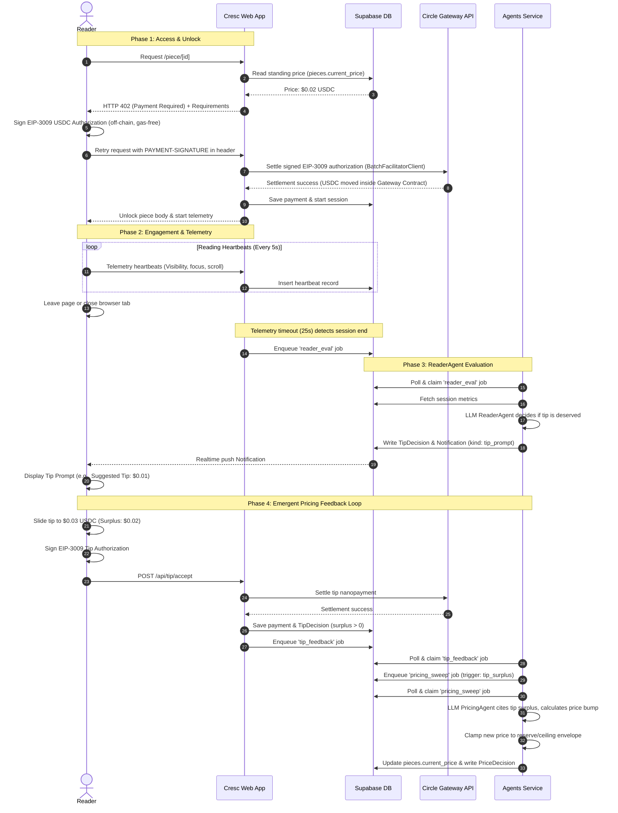

# 

Cresc is a content platform where articles and media carry a **live, self-adjusting price** between **$0.001 and $0.1**. It leverages the **x402 protocol** (HTTP 402 Payment Required for API endpoints) on the **Circle Arc Testnet** to enable sub-cent, gas-free nanopayments.

By splitting web serving from long-running autonomous LLM tasks, Cresc achieves instant content unlocking for readers while allowing AI agents to evaluate attention signals, suggest tips, and dynamically reprice content in the background.

---

## Core System Architecture

Cresc is structured as two separate applications communicating via a Postgres-backed job queue in Supabase.

```
┌─────────────────────────────────────────┐   ┌──────────────────────────────────────────┐
│  web/ (Next.js web app)                 │   │  agents/ (Node.js worker service)        │
│  • Landing page & reader interface      │   │  • PricingAgent sweeps (M5)              │
│  • x402 paywall API routes (M4)         │   │  • ReaderAgent session evaluation (M6)   │
│  • Active dwell telemetry ingest (M2)   │   │  • Tip surplus feedback processor (M7)   │
│  • Tip settle API & Creator dashboard   │   │  • Queue consumer (claims pending jobs)  │
│  • Circle Gateway & reader wallets      │   │  • LLM calls live here — never blocking  │
│  • Job enqueueing (Supabase jobs table) │   │    the web read path                     │
└───────────────────┬─────────────────────┘   └──────────────────┬───────────────────────┘
                    │                                              │
                    └──────────────┬ Supabase ┬──────────────────┘
                                   │ (shared) │
                           ┌───────┴───────────┴───────┐
                           │  Postgres DB              │
                           │  • Creators & pieces state│
                           │  • Telemetry & payments   │
                           │  • jobs queue table       │
                           │  • Realtime channels      │
                           └───────────────────────────┘
```

*   **`web/` (Next.js App)**: Fast, serverless-friendly, and strictly off the LLM critical path. It reads the precomputed `pieces.current_price` and uses EIP-3009 signatures to verify/settle payments instantly.
*   **`agents/` (Node.js Service)**: A persistent background process that runs LLM reasoning loops. It handles pricing sweeps, session evaluations, and is out of the reader's request-response lifecycle.
*   **Supabase Database**: Houses our data models and is used as a lightweight, low-dependency queue (`jobs` table) with realtime wakeup triggers.

---

## User Experience & Money Flow

The diagram below details the end-to-end flow of funds and telemetry across the Cresc system—from reader deposit to creator withdrawal.

```mermaid
graph TD
    subgraph Funding ["1. Funding Rails"]
        Faucet["Circle Faucet (Arc Testnet USDC)"] -->|Fund Wallet| RW["Reader Wallet (EOA Address)"]
        RW -->|Deposit to Gateway Contract| GB["Reader Gateway Balance (Smart Contract)"]
    end

    subgraph Unlock ["2. Content Unlock Flow"]
        GB -->|EIP-3009 Off-chain Signature| Web["Cresc Next.js Web App"]
        Web -->|Submit PAYMENT-SIGNATURE| CircleAPI["Circle Gateway API /settle"]
        CircleAPI -->|Batch Settlement on Arc| SG["Seller Gateway Balance (Smart Contract)"]
        CircleAPI -->|Success Response| ReaderAccess["Unlock content for Reader"]
    end

    subgraph Evaluation ["3. Telemetry & ReaderAgent"]
        ReaderAccess -->|Page Visibility Telemetry| Heartbeats["Supabase DB: heartbeats"]
        Heartbeats -->|Session Timeout (25s) / End| Queue["Supabase DB: jobs queue"]
        Queue -->|Process reader_eval| ReaderAgent["ReaderAgent (Agents Service)"]
        ReaderAgent -->|Tipping Value Judgment| Notify["Supabase DB: notifications"]
        Notify -->|Realtime Push Notification| Prompt["Reader Tip Prompt UI"]
    end

    subgraph Tipping ["4. Tipping & Emergent Feedback Loop"]
        Prompt -->|Reader Accepts & Signs| TipWeb["/api/tip/accept"]
        TipWeb -->|USDC Tip Payment via Gateway| CircleAPI
        TipWeb -->|Final Tip > Suggested Tip| Surplus["Tip Surplus recorded"]
        Surplus -->|Enqueues pricing_sweep job| PricingAgent["PricingAgent (Agents Service)"]
        PricingAgent -->|Reasons and Adjusts Price| Pieces["Supabase DB: pieces.current_price"]
    end

    subgraph Payout ["5. Creator Payout"]
        SG -->|Withdraw /api/withdraw| CW["Creator External Wallet (EOA Address)"]
    end

    style Faucet fill:#f9f,stroke:#333,stroke-width:2px
    style GB fill:#bbf,stroke:#333,stroke-width:2px
    style SG fill:#bfb,stroke:#333,stroke-width:2px
    style CW fill:#fbb,stroke:#333,stroke-width:2px
```

---

## Detailed Nanopayment & Telemetry Sequence

The full sequence of off-chain signature authorization, instant content unlocking, active engagement tracking, and agentic price adjustment:



---

## Agent Framework & The Tipping Loop

Rather than using hardcoded formulaic curves, Cresc utilizes LLM reasoning chains to execute judgments:

### 1. PricingAgent (M5 background sweep)
*   **Role**: Consumes `pricing_sweep` jobs. Determines the optimal current price based on a recency-weighted `SignalBundle` (dwell time, completion rate, unique readers, tips).
*   **Heuristics**: Predicts audience decay, handles brief quiet periods without panic, and differentiates "topic exhaustion" (low views, high dwell) from "poor content quality" (high views, low dwell) to respond differently.
*   **Envelope Protection**: New prices are bounded strictly to `[reserve, ceiling]` with a `max_step` constraint per sweep. The reserve is dynamically calculated by the agent instead of being hardcoded.

### 2. ReaderAgent (M6 session evaluator)
*   **Role**: Consumes `reader_eval` jobs at session-end.
*   **Value Judgment**: Analyzes telemetry variables (focused dwell time vs. word count, scroll patterns, tab status) using the LLM to make a binary decision: *Should we ask for a tip?* (No arbitrary thresholds; a slow reader of a long essay is treated differently than a quick scroll of a short post).
*   **Tip Calculation**: Suggests a tip within `[10%, 100%]` of the initial unlock price based on the value delivered, adding a single-sentence rationale shown directly to the reader.

### 3. Emergent Feedback Loop
If a reader tips *more* than the agent's recommended amount:
1.  A `tip_surplus` is recorded.
2.  A `tip_feedback` job fires off, queuing a fast-track `pricing_sweep` for that piece.
3.  The `PricingAgent` incorporates this surplus as an under-pricing signal, adjusting the standing price upward in response to high user-perceived value.

---

## Creator Dashboard (M8)

Creators have access to an administrative interface displaying:
*   **Live Price Ticker**: Realtime updates of content prices, complete with direction arrows, triggering events, confidence levels, and the agent's short-form rationale.
*   **Reasoning Chains**: An audit log of all pricing decisions. Creator-flagged low-confidence decisions (`confidence < 0.5`) provide a direct Dispute affordance.
*   **Performance Charts**: Interactive analytics tracking price history, revenue, unique readers, and tip surpluses over time.
*   **Settings Panel**: Toggle listed/delisted statuses and select optimization objectives (`MAX_REACH` vs. `MAX_REVENUE`).
*   **Treasury Management**: View Circle Gateway balance and execute withdrawals to external EOA addresses on the Arc Testnet.

---

## Development Setup & Installation

### Prerequisites
*   Node.js v22+
*   A Supabase project (for migrations and queue storage)
*   An LLM Provider API Key (Groq is configured by default; agents run in a mock fallback mode if left empty)
*   Arc Testnet USDC from the [Circle Faucet](https://faucet.circle.com/)

### 1. Install Dependencies
Each app has its own `package.json`. Install dependencies separately:
```bash
cd web && npm install --legacy-peer-deps
cd agents && npm install
```

### 2. Environment Variables
Create a `.env.local` file in **each** app directory using the configuration template:
```bash
cp web/.env.example web/.env.local
cp agents/.env.example agents/.env.local
```

Fill in the required fields (Supabase URLs, service keys, and testnet EOA private keys). Generate development EOA keys if needed:
```bash
cd agents && npm run generate-wallets
```

### 3. Database Setup
Push the Postgres migrations to your Supabase instance:
```bash
npx supabase db push
```

### 4. Seed Data
Populate the database with initial creators, mock articles, and simulated price history:
```bash
cd agents && npm run seed
```

### 5. Start Development Servers
Run the web frontend and agents worker in **separate terminals**:
```bash
# Terminal 1 — Web frontend
cd web && npm run dev

# Terminal 2 — Agents worker
cd agents && npm run dev
```
Open [http://localhost:3000](http://localhost:3000) to view the application.

---

## Testing the Emergent Pricing Loop

To test the end-to-end integration and watch the PricingAgent respond to a tip surplus:

1.  Make sure both development servers are running (web + agents).
2.  In a separate terminal window, launch the demo harness script:
    ```bash
    cd agents && npm run demo -- --tip-surplus
    ```
3.  Observe the terminal logs. The script will:
    *   Initialize a reader session telemetry tracking sequence.
    *   Simulate active reading behavior and trigger a session-end.
    *   Process the `reader_eval` job, generating a tipping prompt.
    *   Simulate a tip payment exceeding the suggested amount.
    *   Trigger an out-of-band pricing sweep showing the price upward adjustment citing the `tip_surplus`.
4.  Check the creator dashboard at `http://localhost:3000/dashboard` to see the live updates and updated sparklines.

---

## Key Files Reference

*   [web/package.json](file:///Users/sachplayz/Projects/Cresc/web/package.json) — Next.js frontend and web client dependencies.
*   [agents/package.json](file:///Users/sachplayz/Projects/Cresc/agents/package.json) — Agents background queue worker packages.
*   [web/lib/circle/index.ts](file:///Users/sachplayz/Projects/Cresc/web/lib/circle/index.ts) — Circle SDK/Arc payment settlement adapter.
*   [web/lib/repo/types.ts](file:///Users/sachplayz/Projects/Cresc/web/lib/repo/types.ts) — Base types and schema definitions.
*   [agents/src/workers/pricing.ts](file:///Users/sachplayz/Projects/Cresc/agents/src/workers/pricing.ts) — Background PricingAgent sweeps logic.
*   [agents/src/workers/reader.ts](file:///Users/sachplayz/Projects/Cresc/agents/src/workers/reader.ts) — Background ReaderAgent session evaluation logic.
*   [agents/scripts/demo-harness.mts](file:///Users/sachplayz/Projects/Cresc/agents/scripts/demo-harness.mts) — Scenario verification and demo runner.
*   [agents/supabase/](file:///Users/sachplayz/Projects/Cresc/agents/supabase/) — Database migrations.
